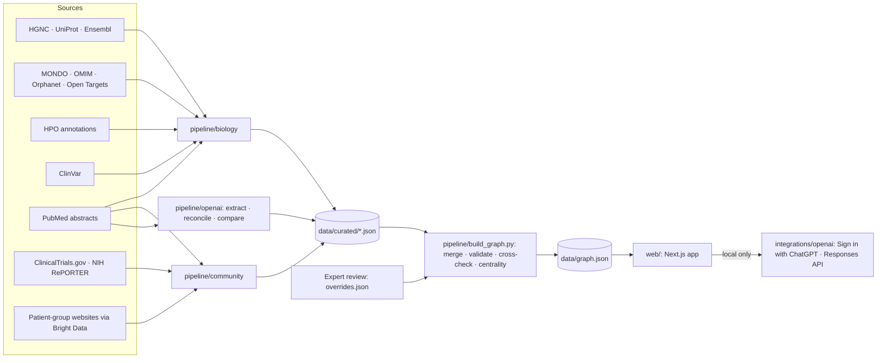

# Rare Disease Atlas

**An evidence-backed map that connects rare diseases by mechanism, so a patient group facing an untreated disease can find who shares its biology, what already exists, and what to do together.**

Hack-Nation 7th Global AI Hackathon · Challenge 05: AI Atlas for the World's Rare Diseases (OpenAI × Buffalo Initiative)

> Every link in the atlas shows where it comes from, how strong it is, what contradicts it, and what is still unknown.

## The demo slice: the SNAREopathies

We start with one mechanism family and do it properly. **SNAREopathies** are disorders of the machinery a neuron uses to release its chemical signals: STXBP1, SYT1, SNAP25, VAMP2, STX1B and their neighbours SYT2, CPLX1, UNC13A, STX1A and NSF. Each has its own diagnosis name, its own small community and often no treatment, yet they break the same machine.

We also added one **bridge gene**, SLC6A1 (a GABA transporter, not part of that machine). The atlas links it to STXBP1 through a shared failure mode, **protein misfolding**, with a shared candidate treatment (the chemical chaperone 4-phenylbutyrate). That link is real: one clinical trial (NCT04937062) already enrols both groups of children. The atlas marks it **contested**, and shows the nine findings that limit it.

## Three questions, one journey

The brief's three questions drive the product:

| Question | What the atlas shows |
|---|---|
| **Who shares our disease characteristics?** | Diseases ranked by shared mechanism first, then by shared *distinctive* symptoms. Broad symptoms such as seizures count for less than rare, informative ones. |
| **What useful work already exists?** | Registries, natural history studies, outcome measures, models and trials from neighbouring diseases, marked *already covers your disease*, *could be adapted* or *not applicable*. |
| **What should we do together?** | Candidate partners (patient groups, researchers who already bridge diseases), a suggested first step, a sourced collaboration proposal, and an honest list of what nobody knows yet. |

**Demo journey.** Maria leads a small VAMP2 patient group. She searches "VAMP2". The atlas shows VAMP2 disrupts the same fusion machinery as STXBP1, a disease with a much larger community. It finds that the Simons Searchlight registry already covers VAMP2, that the STXBP1 community has a natural history study, an outcome-measure consortium and mouse models, and that two Boston Children's studies already enrol both. She leaves with a drafted, cited proposal to the STXBP1 Foundation.

**Honest gap.** A family with a SYT2 diagnosis finds no patient group. The atlas says so plainly, shows the closest community (the congenital myasthenic syndrome registry that lists SYT2), and lists published treatment evidence to discuss with their neurologist.

## What you can do with it

| Page | For | What it does |
|---|---|---|
| `/` search | Everyone | One box for diseases, genes, protein names, symptoms, mechanisms and patient groups, with synonym resolution ("Munc18-1 → STXBP1"). Paste a line from a genetic report and it looks up the variant. |
| `/disease/<gene>` | Patient-group leaders, families | The three questions: closest diseases and why, what already exists (marked *already covers you* or *could be adapted*), what to do together, and what nobody knows yet. Also ideas worth testing, where the pattern breaks, and look-alike diseases beyond the map. |
| `/variant?q=` | Families | A variant from a genetic report → its ClinVar record → the mechanism it points to → what that can mean for therapy approaches, with "same gene, different mechanism" shown side by side. Never advice. |
| `/compare?a=&b=` | Patient-group leaders | "Before we join forces": what two diseases share, what differs (including variant spectrum), which assets cover both, who already works on both, and the questions an expert must answer. |
| `/approach` | Biotech scouts, researchers | Pick a therapeutic approach (gene replacement, knockdown, upregulation, chaperone, symptomatic drug, editing) and see diseases ranked by mechanistic fit, with communities, infrastructure, unmet need, existing programmes and named contacts. |
| `/ideas` | Researchers | "Dots nobody connected": therapy-transfer hypotheses found by graph analytics, each with its chain of evidence, its weakest link, its caveats and a concrete test plan. Drawn dashed, never presented as fact. |
| `/atlas` | Everyone | The graph, coloured by mechanism cluster, with focus mode, progressive reveal and an evidence panel on every link. |
| `/path` | Everyone | The strongest evidence path between any two nodes, explained in plain language. |
| `/method` | Judges, sceptics | How we know: the integrity numbers, the method, and where the pattern breaks. |
| `/impact` | Judges, funders | The 10× case, with sourced timelines. |

A **"Viewing as"** switch (family, patient-group leader, researcher, biotech) changes the order and wording of each page. **Guided tours** follow Maria's VAMP2 group, and a family that finds no patient group.

## Evidence integrity

This is the core design principle, enforced in code rather than promised:

- **Every link has a source.** Database records (OMIM, Orphanet, HPO, ClinVar, GO, ClinicalTrials.gov, NIH RePORTER) or publications.
- **Every literature claim carries a verbatim quote**, string-matched against the stored source text. A quote that doesn't match is rejected, never "fixed".
- **Evidence levels** separate clinical proof, curated databases, experimental work, case reports, links the atlas inferred, and hypotheses. Hypotheses are drawn dashed and never presented as fact.
- **Contradicting evidence is shown, not hidden.** A link with counter-evidence is marked *contested*.
- **An independent OpenAI re-reading** of every cited paper cross-checks the curated links. Disagreements are flagged for expert review.
- **Human review.** A biochemist confirms, corrects or rejects the links the demo relies on; rejected links are removed.
- **Gaps are first-class data.** Each records what was searched and how to find out more.

Current build (live numbers on the app's **How we know** page and in `data/build/report.md`):

| Measure | Value |
|---|---|
| Nodes / links | 397 / 671 |
| Links with at least one source | 671 / 671 |
| Quotes string-verified against the stored source | 705 / 705 |
| Contested links shown with their counter-evidence | 31 |
| OpenAI re-reading: claims extracted from 78 papers, quote-verified | 587 / 587 |
| Agreement between the OpenAI re-reading and the curators, on papers both cite | 60 / 68 (88%) |
| Extra supporting sources found by the re-reading | 111 |
| Gaps recorded, each with the searches behind it | 35 |

## The 10× case

The milestone: a small patient group starts contributing natural history data a future trial could use, and chooses its first research partner.

**What sharing a mechanism has already done once.** STXBP1 families waited about 13 years from the gene's discovery ([PMID:18469812](https://pubmed.ncbi.nlm.nih.gov/18469812/), 2008) to the first gene-specific trial ([NCT04937062](https://clinicaltrials.gov/study/NCT04937062), 2021). SLC6A1 families entered that same trial about 6 years after their gene's discovery ([PMID:25865495](https://pubmed.ncbi.nlm.nih.gov/25865495/), 2015), by joining on the shared protein-misfolding rationale. VAMP2 families are 7.5 years in ([PMID:30929742](https://pubmed.ncbi.nlm.nih.gov/30929742/), 2019) with no trial, and VAMP2 breaks the same fusion machinery as STXBP1. One comparison is not proof, but it shows what a well-chosen partner is worth.

**Today vs with the atlas.** Finding who else works on your biology takes months to years of conferences and cold emails, and a new natural history study commits to five or more years of data collection ([NORD](https://rarediseases.org/rdca-dap-rfp-2026/)). The atlas shows mechanism neighbours, assets that already accept your disease and partners already working across your genes in minutes. It also lists what an expert must check, which takes days to review. Joining what exists then takes weeks: Simons Searchlight already lists VAMP2. The assumptions and what we must validate next are on `/impact`.

## How OpenAI is used

| Step | What it does |
|---|---|
| **Extract** | Reads each abstract and pulls out claims (gene → mechanism, disease → symptom, therapy → target) with a verbatim supporting sentence, using structured outputs. |
| **Reconcile** | Resolves names and synonyms (protein names, older disease names) to one stable node, choosing only from candidate nodes. |
| **Cross-check** | Compares its reading with the curated links: agreements stamp the evidence; disagreements go to human review. |
| **Explain** | Turns a path through the graph into plain language a family can follow. Every sentence cites the links that support it. |
| **Draft** | Writes a sourced collaboration proposal and outreach email from a disease's neighbours, shared assets, partners and gaps. |

Model output is constrained to the evidence it is given. Citations that point outside it are dropped; sentences without a source are shown muted as "AI framing, no direct source".

**Sign in with ChatGPT.** Run locally, the app offers *Continue with ChatGPT*: AI features then run on the user's own ChatGPT plan through OpenAI's open-source token-sharing flow, with no API key. An `OPENAI_API_KEY` works as a fallback. The deployed site serves AI outputs generated in advance, because OpenAI's sign-in flow for hosted sites is still waitlisted.

## Architecture



- **Data contract:** [docs/SCHEMA.md](docs/SCHEMA.md) defines nodes, edges, evidence, confidence and gaps.
- **Pipelines** are standard-library Python with cached raw responses, so a re-run is reproducible and mostly offline.
- **The app** is Next.js with Cytoscape.js. It reads one JSON file and needs no database or server for the public demo.
- **Similarity** uses information content over all 12,867 diseases in HPO, so distinctive symptoms weigh more than common ones.

## Run it locally

```bash
cd web
npm install
npm run dev        # http://127.0.0.1:3000
```

AI features: click **Continue with ChatGPT** in the app (needs a ChatGPT Plus or Pro plan), or sign in from a terminal:

```bash
node integrations/openai/cli.mjs login
```

## Reproduce the dataset

```bash
pipeline/run_all.sh            # add --refresh to re-fetch every source
```

This runs the biology layer, the community layer, the OpenAI cross-check (when signed in), the merge and validation, and copies the graph into the app. Per-layer details are in [docs/agent-reports/](docs/agent-reports/). Bright Data (used for some patient-group pages) needs `BRIGHTDATA_API_TOKEN` in `.env.local`; see [.env.example](.env.example).

## Repository layout

| Path | Contents |
|---|---|
| `web/` | The app |
| `pipeline/biology/` | Genes, diseases, symptoms, variants, mechanisms, therapies |
| `pipeline/community/` | Patient groups, assets, studies, grants, researchers |
| `pipeline/openai/` | OpenAI extraction, reconciliation and cross-check |
| `pipeline/derive/` | Variant lookup, therapy-approach rules, hypotheses, look-alikes, counterexamples |
| `pipeline/contribute/` | Community contributions: fetch a page, extract with OpenAI, verify quotes |
| `pipeline/review_sheet.py`, `apply_review.py` | Expert review sheet and its round trip into the graph |
| `pipeline/build_graph.py` | Merge, validation, derived links, centrality, report |
| `integrations/openai/` | Sign in with ChatGPT and the Responses API client |
| `data/curated/` | Curated graph fragments and expert review decisions |
| `data/graph.json` | The built graph the app reads |
| `docs/` | Schema, integration notes, layer reports, review sheets |

## Limits

- One mechanism family, deliberately. The schema and pipelines are disease-agnostic; adding a family means adding gene lists and curation inputs.
- Mechanism labels are often variant-specific (some SNAP25 and STX1B variants act in opposite directions). The atlas records minority mechanisms rather than forcing one label per gene.
- Researcher records contain professional, public information only. Names are only merged on matching institution or ORCID.
- The atlas does not give medical advice. Treatment evidence is shown as published findings to discuss with a clinician.
