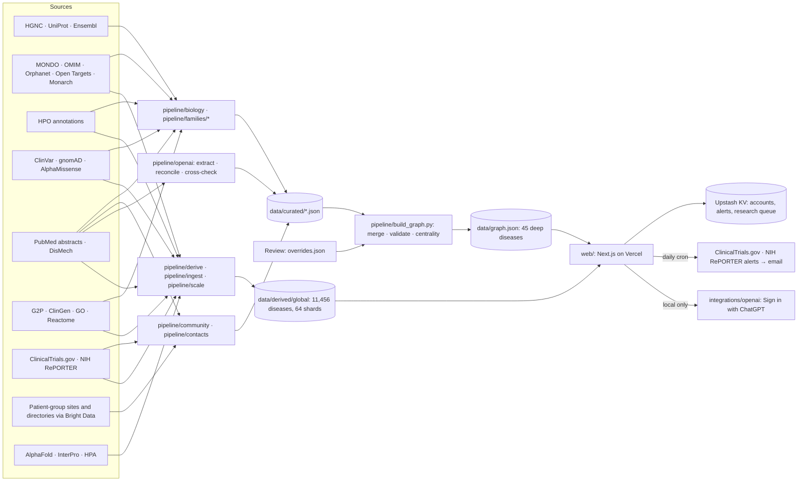

# Tasukeru: an AI atlas for the world's rare diseases

**An evidence-backed map that connects rare diseases by mechanism and symptoms, so a family or patient group facing an untreated disease can find who shares its biology, what already exists, and what to do together.**

Tasukeru (助ける) means "to help" or "to rescue" in Japanese.

Hack-Nation 7th Global AI Hackathon · Challenge 05: AI Atlas for the World's Rare Diseases (OpenAI × Buffalo Initiative)

**Live:** https://rare-disease-atlas-five.vercel.app

> Every link in the atlas shows where it comes from, how strong it is, what contradicts it, and what is still unknown.

## Depth and breadth

| Tier | Diseases | What you get |
|---|---|---|
| **Deep** | 45, in 4 mechanism families: SNAREopathies (11), developmental and epileptic encephalopathies (10), lysosomal diseases (12), RASopathies (12) | Curated graph with verbatim, string-verified quotes; patient groups, assets, trials, grants, researchers; ideas worth testing; AI drafts |
| **Breadth** | 10,309 with sourced, automated data | Symptoms (HPO), genes, mechanism class (G2P, ClinGen), pathways (Reactome), DisMech pathographs, similar diseases, trials, patient groups, prevalence |
| **Searchable** | 11,456 (MONDO-based global index) | A page at `/d/<MONDO>` for every disease |

Every page says which tier it is in.

The deep families started with one mechanism done properly. **SNAREopathies** are disorders of the machinery a neuron uses to release its chemical signals: STXBP1, SYT1, SNAP25, VAMP2, STX1B and neighbours. Each has its own name and small community, yet they break the same machine. The bridge gene SLC6A1 links to STXBP1 through shared protein misfolding and a shared candidate treatment (4-phenylbutyrate). One trial (NCT04937062) already enrols both groups. The atlas marks that link *contested* and shows the findings that limit it.

## Three questions, one journey

| Question | What the atlas shows |
|---|---|
| **Who shares our disease characteristics?** | Diseases ranked by shared specific mechanism and by shared *distinctive* symptoms. Broad symptoms such as seizures count for less than rare, informative ones. |
| **What useful work already exists?** | Registries, natural history studies, outcome measures, models and trials from neighbouring diseases, marked *already covers your disease*, *could be adapted* or *not applicable*. |
| **What should we do together?** | Candidate partners (patient groups, researchers who already bridge diseases), a suggested first step, a sourced collaboration proposal, and an honest list of what nobody knows yet. |

**Guided tour: "Follow a patient group".** A small VAMP2 patient group types the gene name. The atlas shows that VAMP2 disrupts the same fusion machinery as STXBP1, a much larger community. Simons Searchlight already enrols VAMP2. The STXBP1 community has a natural history study, outcome measures and mouse models. The group leaves with a drafted, cited proposal to the STXBP1 Foundation.

**Guided tour: "Follow a family with no patient group".** A family with a SYT2 diagnosis finds no patient group. The atlas says so plainly and shows the closest community (a registry that accepts SYT2). It turns treatment evidence into questions for the child's doctor, and lets the family start the missing group.

## Four views

A **"Viewing as"** switch changes the order, depth and wording of every page:

| View | For | Emphasis |
|---|---|---|
| **Simple** (default) | Families | Plain language, what it means, questions for the doctor, the closest community, contact buttons |
| **Detailed** | Patient-group leaders | Assets, partners, "before we join forces", sourced proposals |
| **Research** | Researchers | Mechanisms, patient population and prevalence, trial readiness, how to reach patients |
| **Industry** | Biotech scouts | Therapy approaches, mechanistic fit, unmet need, existing programmes |

## What you can do with it

| Page | What it does |
|---|---|
| `/` search | One box for 11,456 diseases, genes, protein names, symptoms, mechanisms and patient groups, with synonym resolution ("Munc18-1 → STXBP1"). Guided search asks "Which disease are you looking for?" when a query is ambiguous; `/help` handles no-result searches. |
| `/disease/<gene>` | The deep page: the three questions, ideas worth testing, where the pattern breaks, contacts, and AI drafts. |
| `/d/<MONDO>` | The breadth page for any of 11,456 diseases: symptoms, genes, mechanism, similar diseases, trials, patient groups. |
| `/sequence` | **FASTA/VCF checker, on your device.** A VCF is matched against the full ClinVar set (387k pathogenic or likely-pathogenic variants in 13,292 genes), with gnomAD constraint and AlphaMissense as explanatory gene factors. Nothing is uploaded. Not a diagnostic test. `/sequence/request` explains how to get your raw DNA data from a testing lab. |
| `/variant?q=` | A variant from a genetic report → its ClinVar record → the mechanism it points to → what that can mean for therapy approaches. Never advice. |
| `/compare?a=&b=` | "Before we join forces": what two diseases share, what differs, which assets cover both, who already works on both. |
| `/approach` | Pick a therapeutic approach and see diseases ranked by mechanistic fit, with communities, infrastructure, unmet need and existing programmes. |
| `/ideas` | Therapy-transfer hypotheses found by graph analytics, each with its chain of evidence, weakest link and a test plan. Drawn dashed, never presented as fact. |
| `/research` | Cohort table across the deep diseases: mechanism class, patient groups, registries, recruiting studies, trial readiness, unmet need. |
| `/mechanisms` | Mechanistic similarity on six axes, including AlphaFold all-vs-all structure comparison (17,578 TM-align pairs). |
| `/atlas`, `/path` | The graph, and the strongest evidence path between two nodes, explained in plain language. |
| `/method` | How we know: integrity numbers counted live, and both benchmarks. |
| `/impact` | The 10× case, with sourced timelines. |

## Community

- **Accounts** with onboarding, an inbox and a "My atlas" page (`/me`). Members follow diseases, and can export or delete everything.
- **Live alerts:** a daily cron checks ClinicalTrials.gov and NIH RePORTER for the diseases each member follows and emails a digest.
- **Researcher announcements** go through moderation (`/admin`). Researchers reach members only through a relay, and only members who opted in.
- **Interest counts** are shown only from 5 people up.
- **Published contacts:** 210 patient organisations' published contacts, named contact people that organisations publish themselves, and 1,463 central contacts of recruiting trials. Never individuals' personal details. Anyone can report or remove a contact from `/privacy`.
- **Research queue** (`/research-queue`): volunteers extract claims from papers for diseases outside the deep tier. They use their own OpenAI or Anthropic key in the browser, or the local worker on a ChatGPT plan. The server re-verifies every quote, and the output is reviewed before it is merged.

## Evidence integrity

This is the core design principle, enforced in code rather than promised:

- **Every link has a source:** database records (OMIM, Orphanet, HPO, ClinVar, GO, ClinicalTrials.gov, NIH RePORTER and others) or publications.
- **Every literature claim carries a verbatim quote,** string-matched against the stored source text. A quote that doesn't match is rejected, never "fixed".
- **Evidence levels** separate clinical proof, curated databases, experimental work, observational reports, links the atlas inferred, and hypotheses. Hypotheses are drawn dashed and capped at confidence 0.25.
- **Contradicting evidence is shown, not hidden.** A link with counter-evidence is marked *contested*.
- **An independent OpenAI re-reading** of the cited papers cross-checks the curated links. Disagreements are flagged for expert review.
- **Review is labelled for what it is.** An independent AI review (not a human expert) went through the expert review sheet. A biochemist's review is still open. AI reviews are never shown as human ones.
- **Gaps are first-class data.** Each records what was searched and how to find out more.

Current build of the deep graph (live numbers on `/method` and in `data/build/report.md`):

| Measure | Value |
|---|---|
| Nodes / links | 1,411 / 2,953 |
| Links with at least one source | 2,953 / 2,953 |
| Quotes string-verified against the stored source | 2,090 / 2,090 |
| Contested links shown with their counter-evidence | 75 |
| Agreement between the OpenAI re-reading and the curators, on papers both cite | 60 / 68 (88%) |
| Links independently reviewed by AI (not a human expert) | 63 |
| Gaps recorded, each with the searches behind it | 61 |

## Benchmarks

**Can the atlas spot how progress on one disease could help another?** We hide a known therapy → disease link and ask the atlas to find the hidden disease.

| Benchmark | Cases | Method | Top-5 recall | MRR | Random (top-5 / MRR) |
|---|---|---|---|---|---|
| Curated leave-one-out (`pipeline/eval/transfer_eval.py`) | 56 | Symptoms + specific mechanism | 73% | 0.49 | 12% / 0.10 |
| PrimeKG external (`pipeline/eval/primekg_eval.py`) | 1,300, pool of 256 diseases | Symptoms + 0.5·genes + 0.5·pathways | 49% | 0.37 | 2% / 0.02 |

What they taught us (details in [docs/agent-reports/eval.md](docs/agent-reports/eval.md) and [docs/KNOWLEDGE.md](docs/KNOWLEDGE.md)):

- **Symptoms carry the cross-gene signal.** On PrimeKG, distinctive shared symptoms (HPO, information-content weighted) are the only factor that works across different genes. Same gene and shared pathways add a little.
- Tissue, mutation spectrum, gnomAD constraint, AlphaMissense and AlphaFold structure didn't improve ranking, so they are shown as explanations, not scores. A coarse loss/gain-of-function label made ranking worse.
- **Direction-aware matching** (does the drug raise or lower the function the disease lacks?) is neutral on PrimeKG and right whenever it fires, so it is kept as a flag, not a score.
- **Similarity is not a safety signal:** contraindicated drugs rank mid-pool.
- The curated benchmark is partly circular: the same literature built the graph and the test. Read a high rank as a reason to look, not as proof. Weights are tuned with nested cross-validation.

## The 10× case

The milestone: a small patient group starts contributing natural history data a future trial could use, and chooses its first research partner.

**What sharing a mechanism has already done once.** STXBP1 families waited about 13 years from the gene's discovery ([PMID:18469812](https://pubmed.ncbi.nlm.nih.gov/18469812/), 2008) to the first gene-specific trial ([NCT04937062](https://clinicaltrials.gov/study/NCT04937062), 2021). SLC6A1 families entered that same trial about 6 years after their gene's discovery ([PMID:25865495](https://pubmed.ncbi.nlm.nih.gov/25865495/), 2015), by joining on the shared protein-misfolding rationale. VAMP2 families are 7.5 years in ([PMID:30929742](https://pubmed.ncbi.nlm.nih.gov/30929742/), 2019) with no trial, and VAMP2 breaks the same fusion machinery as STXBP1. One comparison is not proof, but it shows what a well-chosen partner is worth.

**Today vs with the atlas.** Finding who else works on your biology takes months to years of conferences and cold emails. A new natural history study commits to five or more years of data collection ([NORD](https://rarediseases.org/rdca-dap-rfp-2026/)). The atlas shows mechanism neighbours, assets that already accept your disease, and partners already working across your genes, in minutes. It also lists what an expert must check, which takes days to review. Joining what exists then takes weeks: Simons Searchlight already lists VAMP2. The assumptions, and what we must validate next, are on `/impact`.

## How OpenAI is used

| Step | What it does |
|---|---|
| **Extract** | Reads each abstract and pulls out claims (gene → mechanism, disease → symptom, therapy → target) with a verbatim supporting sentence, using structured outputs. |
| **Reconcile** | Resolves names and synonyms (protein names, older disease names) to one stable node, choosing only from candidate nodes. |
| **Cross-check** | Compares its reading with the curated links: agreements stamp the evidence, disagreements go to review (88% agreement on the SNAREopathy papers). |
| **Explain** | Turns a path through the graph into plain language a family can follow. Every sentence cites the links that support it. |
| **Draft** | Writes sourced collaboration proposals, outreach emails and experiment plans from a disease's neighbours, shared assets, partners and gaps. 58 drafts are precomputed in `data/ai/`. |
| **Research queue** | Volunteers' OpenAI (or Claude) extractions for breadth diseases, re-verified by the server. |

Model output is constrained to the evidence it is given. Citations that point outside it are dropped. Sentences without a source are shown muted as "AI framing, no direct source".

**Sign in with ChatGPT.** Run locally, the app offers *Continue with ChatGPT*: AI features then run on the user's own ChatGPT plan through OpenAI's open-source token-sharing flow, with no API key. An `OPENAI_API_KEY` works as a fallback. The deployed site serves AI outputs generated in advance, because OpenAI's sign-in flow for hosted sites is still waitlisted.

## Architecture



- **Data contract:** [docs/SCHEMA.md](docs/SCHEMA.md) defines nodes, edges, evidence, confidence and gaps.
- **Pipelines** are mostly standard-library Python with cached raw responses, so a re-run is reproducible and mostly offline.
- **The app** is Next.js with Cytoscape.js. The public data is static JSON (the global index is sharded by `djb2(MONDO) % 64`); Upstash KV holds only accounts, follows and the research queue.
- **Similarity** uses information content over about 12.9k diseases in HPO, so distinctive symptoms weigh more than common ones.

## Run it locally

```bash
cd web
npm install
npm run dev        # http://127.0.0.1:3000 (use 127.0.0.1, not localhost)
```

AI features: click **Continue with ChatGPT** in the app (needs a ChatGPT Plus or Pro plan), or sign in from a terminal:

```bash
node integrations/openai/cli.mjs login
```

Locally the app keeps accounts in a JSON file store in `web/.data/`. Secrets go in `.env.local` (see [.env.example](.env.example)).

## Reproduce the dataset

```bash
pipeline/run_all.sh                    # deep graph; add --refresh to re-fetch every source
python3 pipeline/build_graph.py        # merge data/curated/*.json -> data/graph.json ("Problems: None")
node web/scripts/sync-data.mjs         # copy data into the app (predev and prebuild run it too)
```

The global layers (`pipeline/derive/global_index.py`, `mechanism_index.py`, `pipeline/ingest/*`, `pipeline/scale/*`) re-fetch their large downloads into the gitignored `data/raw/downloads/`. Per-layer details are in [docs/agent-reports/](docs/agent-reports/). Bright Data (some patient-group pages) needs `BRIGHTDATA_API_TOKEN` in `.env.local`.

## Repository layout

| Path | Contents |
|---|---|
| `web/` | The app (Next.js) |
| `pipeline/biology/`, `pipeline/families/` | Deep families: genes, diseases, symptoms, variants, mechanisms, therapies |
| `pipeline/community/`, `pipeline/contacts/` | Patient groups, assets, studies, grants, researchers; published contacts |
| `pipeline/openai/` | OpenAI extraction, reconciliation and cross-check |
| `pipeline/derive/` | Global index, mechanism layer, hypotheses, look-alikes, mechanistic similarity |
| `pipeline/ingest/`, `pipeline/scale/` | ClinVar, gnomAD, AlphaMissense, PrimeKG, direction layer; trials and patient groups at scale |
| `pipeline/eval/` | Leave-one-out and PrimeKG benchmarks |
| `pipeline/crowd/`, `pipeline/contribute/` | Research-queue export; community contributions |
| `pipeline/build_graph.py` | Merge, validation, derived links, centrality, report |
| `integrations/openai/` | Sign in with ChatGPT and the Responses API client |
| `data/curated/` | Curated graph fragments and review decisions (`overrides.json`) |
| `data/derived/` | Global index, features, contacts, population, direction, evaluations |
| `data/graph.json` | The built deep graph |
| `docs/` | Schema, knowledge base, to-do list, layer reports, review sheets |

## Limits

- Depth covers 45 diseases in 4 families. Breadth data for the other diseases is automated and says so.
- Mechanism labels are often variant-specific (some SNAP25 and STX1B variants act in opposite directions). The atlas records minority mechanisms rather than forcing one label per gene.
- ClinVar lacks most repeat expansions (e.g. the HTT CAG repeat), so the checker covers small variants only.
- Researcher records contain professional, public information only.
- The atlas does not give medical advice. Treatment evidence is shown as published findings to discuss with a clinician. The DNA checker is not a diagnostic test.

## Acknowledgements

We thank Woan-Yu Lin (RTW Foundation, Rare Disease Advising Program) and Joe Katakowski for conversations that gave us valuable insight while we built the atlas.

Our collaborator Chronify-CH built the mechanistic similarity layer, the AlphaFold all-vs-all TM-align comparison, the research recommendations and `/mechanisms`.

Data: [DisMech](https://dismech.monarchinitiative.org) (Monarch Initiative, BSD-3-Clause), [PrimeKG](https://github.com/mims-harvard/PrimeKG) (MIT / CC0), [Orphadata](https://www.orphadata.com) (CC BY 4.0), AlphaMissense (see the licence note in `data/derived/ingest/README.md`), ChEMBL via the Open Targets Platform, and the public resources of NCBI, EBI, NIH, HPO, MONDO, ClinGen, Gene2Phenotype, Reactome, GO, UniProt, AlphaFold DB and the Human Protein Atlas.
